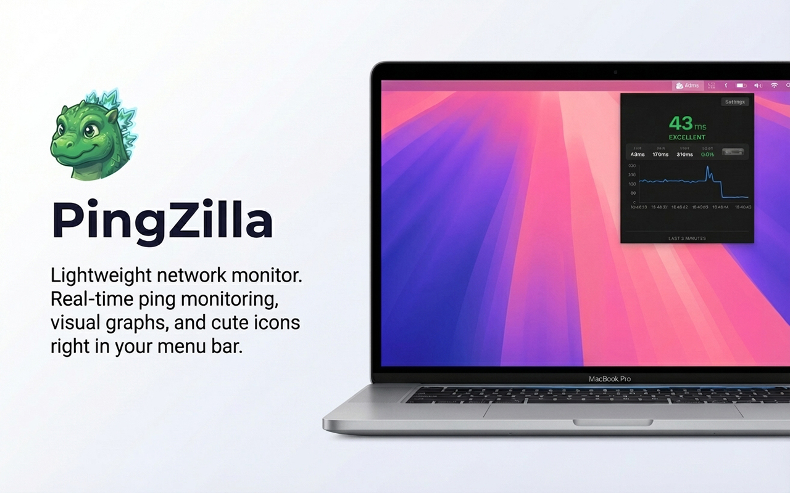
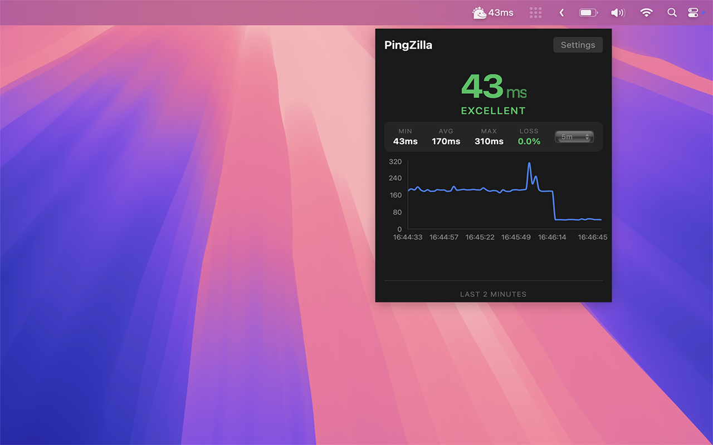

# PingZilla

> *When your latency needs a monster to keep it in check*

<p align="center">
  
</p>

<p align="center">
  <a href="https://apps.apple.com/app/pingzilla/id6757017560">
    
  </a>
</p>

A lightweight macOS menu bar application that monitors your network latency in real-time. Built with Tauri 2, React, and Rust.

## Features

- **Live Menu Bar Display** - Current ping displayed right in your menu bar
- **Dynamic Menu Bar Icons** - PingZilla's mood changes based on latency:
  - Happy (< 60ms) - Everything is great!
  - Angry (60-150ms) - Getting concerned...
  - Sad (> 150ms) - Network troubles!
  - Dead (timeout) - No response!
- **IP Geolocation** - See your public IP address and country with flag emoji - perfect for VPN users
- **Site Monitoring** - Monitor up to 10 websites or servers with 60-second check intervals
- **Down Alerts** - Get notified when monitored sites go down
- **Multiple Targets** - Monitor multiple hosts simultaneously
- **Statistics Dashboard** - View min/max/avg latency, uptime percentage, and packet loss
- **Real-Time Graph** - Visual history of the last 2 minutes of ping data
- **Display Mode Options** - Choose what to show in menu bar:
  - Icon + Ping (default)
  - Icon Only
  - Ping Only
- **Smart Notifications** - Get alerted when latency exceeds your threshold (default: 400ms)
- **Configurable Target** - Ping any host (default: 8.8.8.8)
- **Persistent History** - Stores up to 24 hours of ping data locally
- **Smooth Animations** - Buttery smooth number transitions
- **Native Performance** - Rust backend with minimal resource usage
- **No Root Required** - Uses system ping command

## Menu Bar Icons

PingZilla uses expressive icons to show network health at a glance:

| Icon | Latency | Mood |
|------|---------|------|
|  | < 60ms | Happy |
|  | 60-150ms | Angry |
|  | > 150ms | Sad |
|  | Timeout | Dead |

## Screenshots

<p align="center">
  
</p>

<p align="center">
  
  
</p>

## Installation

### Mac App Store (Recommended)

<a href="https://apps.apple.com/app/pingzilla/id6757017560">
  
</a>

The easiest way to install PingZilla with automatic updates.

### From Release

Download the latest `.dmg` from the [Releases](https://github.com/PiXeL16/Pingzilla/releases) page.

### Build from Source

#### Prerequisites

- [Node.js](https://nodejs.org/) (v18+)
- [pnpm](https://pnpm.io/)
- [Rust](https://rustup.rs/)
- Xcode Command Line Tools

#### Steps

```bash
# Clone the repo
git clone https://github.com/PiXeL16/Pingzilla.git
cd Pingzilla

# Install dependencies
pnpm install

# Run in development mode
pnpm tauri dev

# Build for production
pnpm tauri build
```

The built app will be in `src-tauri/target/release/bundle/macos/`.

### App Store Build

To build for Mac App Store submission:

```bash
# Full pipeline: build universal binary, sign, and create .pkg
make appstore

# Or step by step:
make universal    # Build universal binary (Intel + Apple Silicon)
make sign         # Sign with Apple Distribution certificate
make pkg          # Create signed installer package
make upload       # Show upload instructions
```

**Prerequisites for App Store:**
1. Apple Developer account
2. App Store provisioning profile (save as `src-tauri/embedded.provisionprofile`)
3. Certificates installed in Keychain:
   - Apple Distribution certificate
   - 3rd Party Mac Developer Installer certificate
4. Apple WWDR intermediate certificate

## Usage

1. **Launch** - PingZilla appears in your menu bar showing the current ping
2. **Click** the menu bar icon to open the detailed view with graph
3. **Right-click** to access the quit menu
4. **Settings** - Click "Settings" in the popup to configure:
   - **Target**: The host to ping
   - **Alert threshold**: Latency (in ms) that triggers notifications
   - **Display Mode**: What to show in the menu bar

## Tech Stack

- **Frontend**: React 19, TypeScript, Recharts
- **Backend**: Rust, Tauri 2
- **Build**: Vite, pnpm

## Make Targets

Run `make help` to see all available commands:

| Command | Description |
|---------|-------------|
| `make dev` | Start development server with hot reload |
| `make build` | Build for current architecture |
| `make universal` | Build universal binary (Intel + Apple Silicon) |
| `make appstore` | Full App Store build pipeline |
| `make sign` | Sign app for distribution |
| `make pkg` | Create installer package |
| `make upload` | Show upload instructions |
| `make clean` | Clean build artifacts |
| `make lint` | Run linters |
| `make info` | Show build info |

## Color Indicators

| Color  | Latency    | Status    |
|--------|------------|-----------|
| Green  | < 60ms     | Excellent |
| Yellow | 60-150ms   | Good      |
| Red    | > 150ms    | Poor      |
| Gray   | Timeout    | No response |

## License

MIT

## Authors

Chriszilla & Claudio

---

*PingZilla: Stomping latency since 2024*
